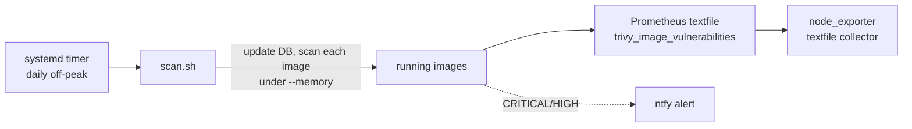

# trivy-scanner

A lightweight, RAM-bounded Trivy CVE scanner for a self-hosted Docker fleet. It
runs as a systemd timer, scans every running image sequentially under a memory
limit, and writes a Prometheus textfile metric plus optional ntfy alerts.

## Why
On a memory-constrained host you cannot afford a heavy always-on scanner. This is
an ephemeral one-shot: update the vuln DB, scan each running image under
`--memory`, emit `trivy_image_vulnerabilities{image,severity}` for
node_exporter's textfile collector, then exit. Sequential and capped, so it never
tips a tight host.

## Use
- `scan.sh` is the scanner. Env-configurable: `TRIVY_SEVERITY`,
  `TRIVY_MEM_LIMIT`, `NTFY_URL`, `TEXTFILE_DIR`.
- `systemd/trivy-scan.{service,timer}` for a daily off-peak run at idle IO
  priority.

## Output
- Prometheus: per-image HIGH and CRITICAL counts plus scanned, failed and
  last-run gauges
- Optional ntfy push when CRITICAL or HIGH totals are non-zero

MIT licensed.

## About this snapshot

This repository is a curated, secret-free extract from a private source repository.
A script performs the extraction: it drops non-public files, rewrites internal
addresses and paths to placeholders, and requires two independent secret scanners
to pass before anything is pushed.

The development history stays private, which is why you see a single commit here
instead of the real timeline. The code itself is not a demo: it runs in my own
infrastructure and is maintained there.
