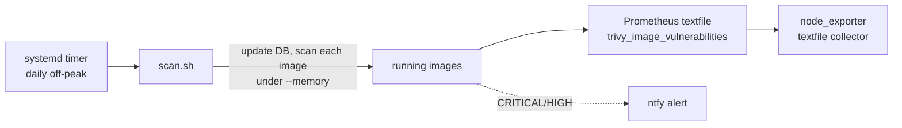

# trivy-scanner

A lightweight, RAM-bounded Trivy CVE scanner for a self-hosted Docker fleet. It
runs as a systemd timer, scans every running image sequentially under a memory
limit, and writes a Prometheus textfile metric plus optional ntfy alerts.

## Why
A permanently running scanner would take memory this host does not have. So this
one is a single shot. It updates the vulnerability database, walks the running
images one at a time under `--memory`, writes
`trivy_image_vulnerabilities{image,severity}` for node_exporter's textfile
collector, and exits. Nothing stays resident between runs.

## Use
- `scan.sh` is the scanner. Env-configurable: `TRIVY_SEVERITY`,
  `TRIVY_MEM_LIMIT`, `NTFY_URL`, `TEXTFILE_DIR`.
- `systemd/trivy-scan.{service,timer}` for a daily off-peak run at idle IO
  priority.

## Output
- Prometheus: per-image HIGH and CRITICAL counts plus scanned, failed and
  last-run gauges
- Optional ntfy push when CRITICAL or HIGH totals are non-zero

MIT licensed.

## About this snapshot

Almost nothing had to be removed here, because a scanner script carries no
topology. It went through the same publishing pass as my other repos anyway:
placeholders for internal addresses, two secret scanners, no push unless both
stay quiet.

The single commit is a consequence of keeping the history private. This runs
nightly against my own fleet.
